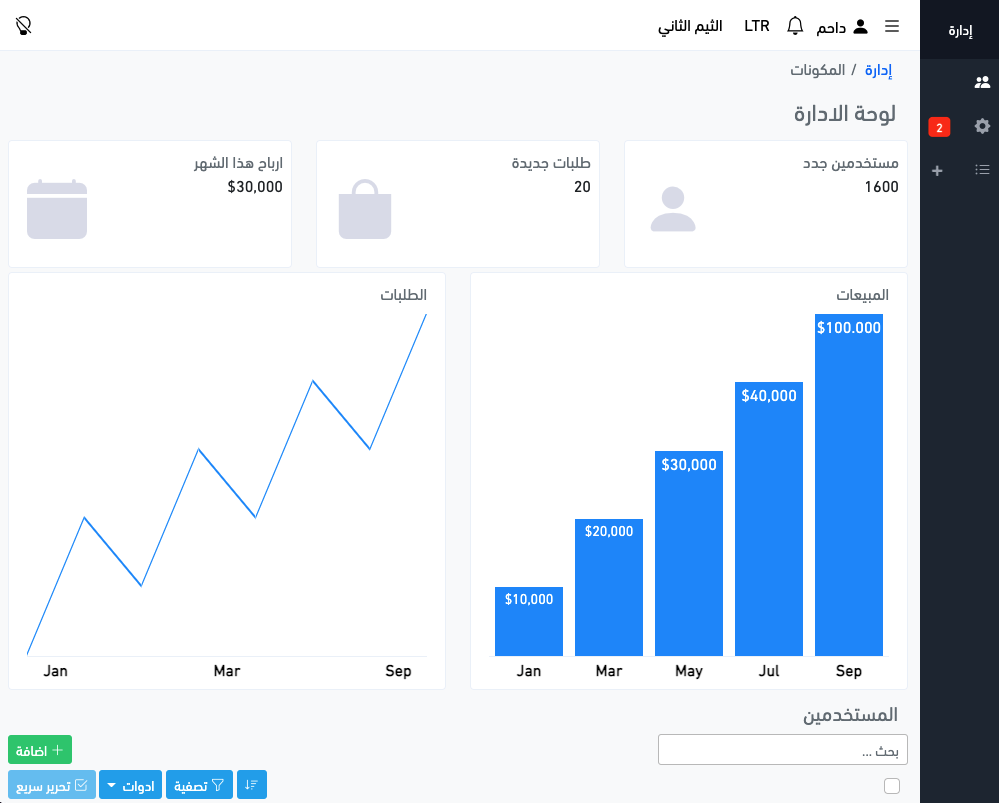
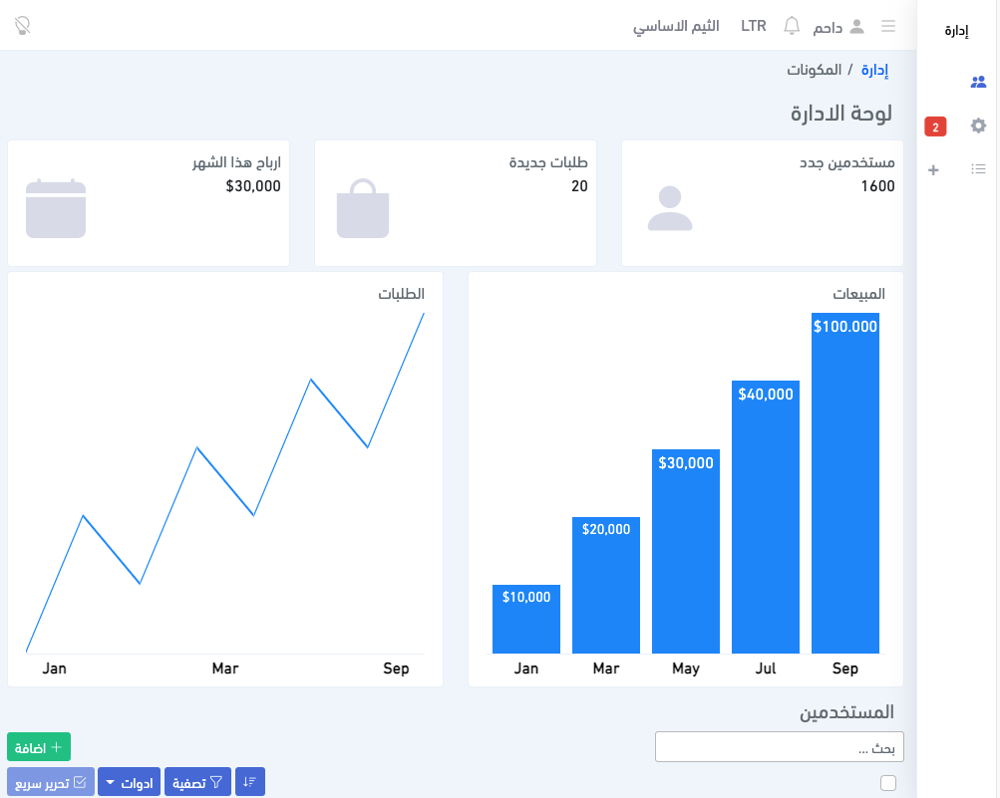
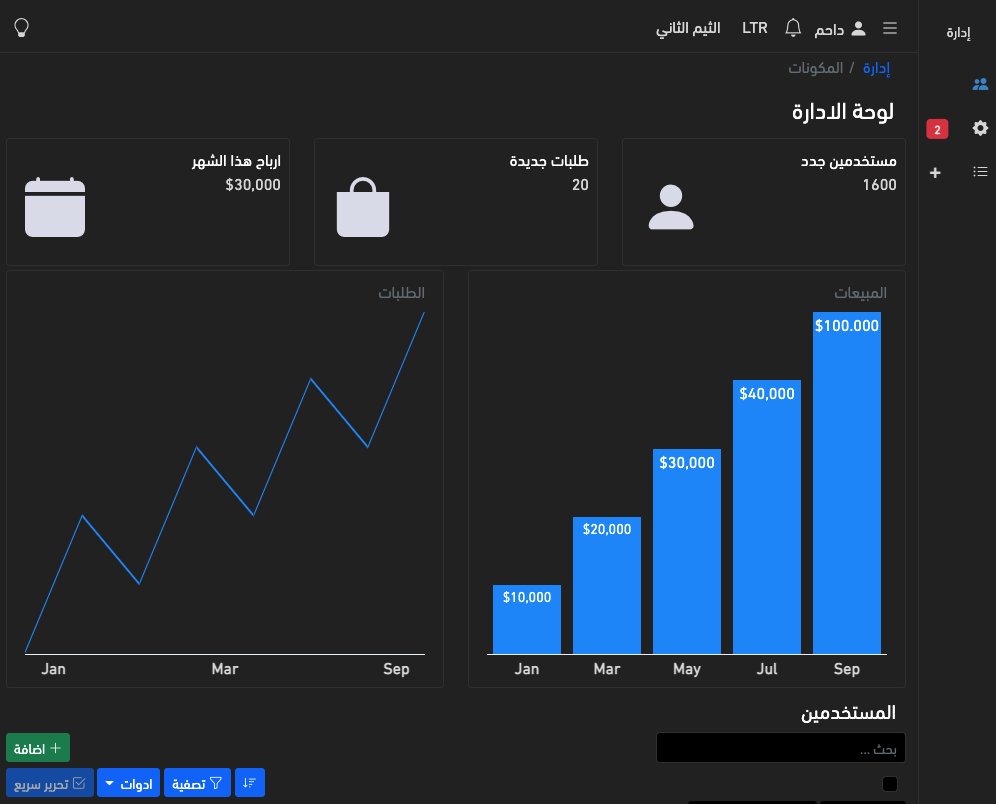

## edarah | admin-template

Simple and responsive using html , css ,ssas and js  
With support for right-to-left direction and night mode

## Demo

https://edarah.netlify.app

     

    

    

You can change sass variables if you need to change theme:  
in `scss/admin-secondary-theme.scss`  
then build `sass scss/admin.scss css/app.css`

##  plugins

https://github.com/ChartsCSS/charts.css

https://github.com/zalog/placeholder-loading
